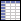

# Методичка по компонентам wxWidgets с примерами и ссылками на документацию

## Оглавление (вкладки в wxFormBuilder)

1. [Вкладка Common](#common)  
2. [Вкладка Additional](#additional)  
3. [Вкладка Data](#data)  
4. [Вкладка Containers](#containers)  
5. [Вкладка Menu/Toolbar](#menu_toolbar)  
6. [Вкладка Layout](#layout)  
7. [Вкладка Forms](#forms)  
8. [Вкладка Ribbon](#ribbon)

---

<a name="common"></a>
## 1. Вкладка Common

### 1.1. wxButton


- **Назначение**: Обычная кнопка. При нажатии генерирует событие (например, `EVT_BUTTON`).
- **Пример кода**:
  ```cpp
  wxButton* myButton = new wxButton(parent, wxID_ANY, "Click me");
  ```

#### Дополнительные примеры:
```cpp
// Пример 1. Обработка события нажатия кнопки
wxButton* myButton2 = new wxButton(parent, wxID_ANY, "Push me");
myButton2->Bind(wxEVT_BUTTON, [&](wxCommandEvent& event) {
    wxMessageBox("Кнопка нажата!", "Информация", wxOK | wxICON_INFORMATION, parent);
});

// Пример 2. Задание определённого размера кнопки
wxButton* myButton3 = new wxButton(parent, wxID_ANY, "Custom Size", wxPoint(10, 10), wxSize(150, 50));

// Пример 3. Изменение надписи на кнопке после нажатия
wxButton* myButton4 = new wxButton(parent, wxID_ANY, "Change Label");
myButton4->Bind(wxEVT_BUTTON, [=](wxCommandEvent& event) {
    myButton4->SetLabel("Label Changed");
});
```

**Официальная документация**:  
[https://docs.wxwidgets.org/3.2.6/classwx_button.html](https://docs.wxwidgets.org/3.2.6/classwx_button.html)

---

### 1.2. wxStaticText


- **Назначение**: Неподвижный текст (лейбл) для описаний, заголовков.
- **Пример кода**:
  ```cpp
  wxStaticText* label = new wxStaticText(parent, wxID_ANY, "Label text");
  ```

#### Дополнительные примеры:
```cpp
// Пример 1. Использование стилей для выравнивания текста
wxStaticText* label2 = new wxStaticText(parent, wxID_ANY, "Centered text", 
                                        wxDefaultPosition, wxDefaultSize, 
                                        wxALIGN_CENTER);

// Пример 2. Изменение цвета и шрифта текста
wxStaticText* label3 = new wxStaticText(parent, wxID_ANY, "Colored text");
label3->SetForegroundColour(*wxBLUE);
wxFont font(12, wxFONTFAMILY_SWISS, wxFONTSTYLE_NORMAL, wxFONTWEIGHT_BOLD);
label3->SetFont(font);

// Пример 3. Динамическое изменение текста
wxStaticText* label4 = new wxStaticText(parent, wxID_ANY, "Dynamic text");
label4->SetLabel("New Label Text");
```

**Официальная документация**:  
[https://docs.wxwidgets.org/3.2.6/classwx_static_text.html](https://docs.wxwidgets.org/3.2.6/classwx_static_text.html)

---

### 1.3. wxTextCtrl


- **Назначение**: Однострочное или многострочное поле для ввода и редактирования текста.
- **Пример кода**:
  ```cpp
  wxTextCtrl* textBox = new wxTextCtrl(parent, wxID_ANY, "Default text");
  ```

#### Дополнительные примеры:
```cpp
// Пример 1. Создание многострочного поля
wxTextCtrl* multiLineText = new wxTextCtrl(parent, wxID_ANY, "Многострочный\nтекст",
                                           wxDefaultPosition, wxDefaultSize,
                                           wxTE_MULTILINE);

// Пример 2. Запрет на редактирование (только чтение)
wxTextCtrl* readOnlyText = new wxTextCtrl(parent, wxID_ANY, "Read only text",
                                          wxDefaultPosition, wxDefaultSize,
                                          wxTE_READONLY);

// Пример 3. Обработка события изменения текста
wxTextCtrl* changeText = new wxTextCtrl(parent, wxID_ANY, "");
changeText->Bind(wxEVT_TEXT, [&](wxCommandEvent& evt){
    wxString newValue = changeText->GetValue();
    wxLogMessage("Текст изменён: %s", newValue);
});
```

**Официальная документация**:  
[https://docs.wxwidgets.org/3.2.6/classwx_text_ctrl.html](https://docs.wxwidgets.org/3.2.6/classwx_text_ctrl.html)

---

### 1.4. wxCheckBox


- **Назначение**: Флажок (галочка) для включения/выключения опции.
- **Пример кода**:
  ```cpp
  wxCheckBox* check = new wxCheckBox(parent, wxID_ANY, "Enable feature?");
  ```

#### Дополнительные примеры:
```cpp
// Пример 1. Проверка состояния флажка при нажатии
wxCheckBox* check2 = new wxCheckBox(parent, wxID_ANY, "Check me!");
check2->Bind(wxEVT_CHECKBOX, [&](wxCommandEvent& event){
    if (check2->IsChecked()) {
        wxLogMessage("Флажок установлен");
    } else {
        wxLogMessage("Флажок снят");
    }
});

// Пример 2. Изначально установленный флажок
wxCheckBox* check3 = new wxCheckBox(parent, wxID_ANY, "Pre-checked");
check3->SetValue(true);

// Пример 3. Отключение и включение элемента
wxCheckBox* check4 = new wxCheckBox(parent, wxID_ANY, "Disable me");
check4->Enable(false);
```

**Официальная документация**:  
[https://docs.wxwidgets.org/3.2.6/classwx_check_box.html](https://docs.wxwidgets.org/3.2.6/classwx_check_box.html)

---

### 1.5. wxRadioButton


- **Назначение**: Радиокнопка. Обычно в группе позволяет выбрать один из нескольких вариантов.
- **Пример кода**:
  ```cpp
  wxRadioButton* radio1 = new wxRadioButton(parent, wxID_ANY, "Option A");
  wxRadioButton* radio2 = new wxRadioButton(parent, wxID_ANY, "Option B");
  ```

#### Дополнительные примеры:
```cpp
// Пример 1. Группа радиокнопок
wxRadioButton* radioA = new wxRadioButton(parent, wxID_ANY, "Choice 1", 
                                          wxDefaultPosition, wxDefaultSize, 
                                          wxRB_GROUP);
wxRadioButton* radioB = new wxRadioButton(parent, wxID_ANY, "Choice 2");
wxRadioButton* radioC = new wxRadioButton(parent, wxID_ANY, "Choice 3");

// Пример 2. Проверка, какая радиокнопка выбрана
radioA->Bind(wxEVT_RADIOBUTTON, [&](wxCommandEvent& event){
    wxLogMessage("Выбрана радиокнопка A");
});
radioB->Bind(wxEVT_RADIOBUTTON, [&](wxCommandEvent& event){
    wxLogMessage("Выбрана радиокнопка B");
});
radioC->Bind(wxEVT_RADIOBUTTON, [&](wxCommandEvent& event){
    wxLogMessage("Выбрана радиокнопка C");
});

// Пример 3. Установка значения по умолчанию
radioC->SetValue(true);
```

**Официальная документация**:  
[https://docs.wxwidgets.org/3.2.6/classwx_radio_button.html](https://docs.wxwidgets.org/3.2.6/classwx_radio_button.html)

---

### 1.6. wxComboBox / wxChoice


- **Назначение**: Выпадающий список. `wxComboBox` обычно редактируемая, `wxChoice` – только выбор из списка.
- **Пример кода**:
  ```cpp
  wxComboBox* combo = new wxComboBox(parent, wxID_ANY);
  combo->Append("Item 1");
  combo->Append("Item 2");
  ```

#### Дополнительные примеры:
```cpp
// Пример 1. Добавление множества значений сразу
wxArrayString items;
items.Add("Apple");
items.Add("Banana");
items.Add("Cherry");
wxChoice* choiceCtrl = new wxChoice(parent, wxID_ANY, 
                                    wxDefaultPosition, wxDefaultSize, items);

// Пример 2. Обработка выбора в wxComboBox
wxComboBox* combo2 = new wxComboBox(parent, wxID_ANY, "Type here");
combo2->Append("Option A");
combo2->Append("Option B");
combo2->Bind(wxEVT_COMBOBOX, [&](wxCommandEvent& event){
    wxString selected = combo2->GetValue();
    wxLogMessage("Вы выбрали: %s", selected);
});

// Пример 3. Установка выбранного элемента по индексу
combo2->SetSelection(1);
```

**Официальная документация**:  
- wxComboBox: [https://docs.wxwidgets.org/3.2.6/classwx_combo_box.html](https://docs.wxwidgets.org/3.2.6/classwx_combo_box.html)  
- wxChoice: [https://docs.wxwidgets.org/3.2.6/classwx_choice.html](https://docs.wxwidgets.org/3.2.6/classwx_choice.html)

---

### 1.7. wxSlider


- **Назначение**: Ползунок для выбора значения в диапазоне.
- **Пример кода**:
  ```cpp
  wxSlider* slider = new wxSlider(parent, wxID_ANY, 50, 0, 100);
  ```

#### Дополнительные примеры:
```cpp
// Пример 1. Обработка события изменения ползунка
wxSlider* slider2 = new wxSlider(parent, wxID_ANY, 25, 0, 100);
slider2->Bind(wxEVT_SLIDER, [&](wxCommandEvent& event){
    int current = slider2->GetValue();
    wxLogMessage("Текущее значение: %d", current);
});

// Пример 2. Установка шага (тик)
wxSlider* slider3 = new wxSlider(parent, wxID_ANY, 0, 0, 100, 
                                 wxDefaultPosition, wxDefaultSize, 
                                 wxSL_HORIZONTAL | wxSL_TICKS);
slider3->SetTickFreq(10);

// Пример 3. Вертикальный ползунок
wxSlider* slider4 = new wxSlider(parent, wxID_ANY, 50, 0, 100,
                                 wxDefaultPosition, wxSize(50, 200),
                                 wxSL_VERTICAL | wxSL_LABELS);
```

**Официальная документация**:  
[https://docs.wxwidgets.org/3.2.6/classwx_slider.html](https://docs.wxwidgets.org/3.2.6/classwx_slider.html)

---

### 1.8. wxGauge


- **Назначение**: Прогресс-бар, отображающий степень выполнения процесса.
- **Пример кода**:
  ```cpp
  wxGauge* gauge = new wxGauge(parent, wxID_ANY, 100);
  gauge->SetValue(30);
  ```

#### Дополнительные примеры:
```cpp
// Пример 1. Увеличение значения в цикле
wxGauge* gauge2 = new wxGauge(parent, wxID_ANY, 100);
for (int i = 0; i <= 100; i += 10) {
    gauge2->SetValue(i);
    wxMilliSleep(200);
    wxYield();
}

// Пример 2. Стиль wxGA_VERTICAL
wxGauge* gauge3 = new wxGauge(parent, wxID_ANY, 50, 
                              wxDefaultPosition, wxSize(30, 150), 
                              wxGA_VERTICAL);
gauge3->SetValue(10);

// Пример 3. "Бесконечный" индикатор
wxGauge* gauge4 = new wxGauge(parent, wxID_ANY, wxGA_HORIZONTAL | wxGA_SMOOTH);
gauge4->Pulse();
```

**Официальная документация**:  
[https://docs.wxwidgets.org/3.2.6/classwx_gauge.html](https://docs.wxwidgets.org/3.2.6/classwx_gauge.html)

---

### 1.9. wxStaticLine


- **Назначение**: Разделительная линия.
- **Пример кода**:
  ```cpp
  wxStaticLine* line = new wxStaticLine(parent, wxID_ANY);
  ```

#### Дополнительные примеры:
```cpp
// Пример 1. Горизонтальная линия с определённым размером
wxStaticLine* line2 = new wxStaticLine(parent, wxID_ANY, 
                                       wxPoint(10, 10), wxSize(200, 2));

// Пример 2. Вертикальная линия
wxStaticLine* line3 = new wxStaticLine(parent, wxID_ANY, 
                                       wxPoint(10, 10), wxSize(2, 100),
                                       wxLI_VERTICAL);
```

**Официальная документация**:  
[https://docs.wxwidgets.org/3.2.6/classwx_static_line.html](https://docs.wxwidgets.org/3.2.6/classwx_static_line.html)

---

### 1.10. wxBitmapButton


- **Назначение**: Кнопка с изображением (иконкой) вместо текстовой метки.
- **Пример кода**:
  ```cpp
  wxBitmapButton* btn = new wxBitmapButton(parent, wxID_ANY, myBitmap);
  ```

#### Дополнительные примеры:
```cpp
// Пример 1. Загрузка bitmap из файла
wxBitmap bitmapFromFile("myimage.png", wxBITMAP_TYPE_PNG);
wxBitmapButton* btn2 = new wxBitmapButton(parent, wxID_ANY, bitmapFromFile);

// Пример 2. Обработка события нажатия
btn2->Bind(wxEVT_BUTTON, [&](wxCommandEvent& event){
    wxLogMessage("Нажата кнопка с изображением!");
});

// Пример 3. Создание кнопок разного размера (при масштабировании изображения)
wxBitmap bitmapSmall = bitmapFromFile.ConvertToImage().Scale(16, 16);
wxBitmapButton* btn3 = new wxBitmapButton(parent, wxID_ANY, bitmapSmall,
                                          wxDefaultPosition, wxSize(32,32));
```

**Официальная документация**:  
[https://docs.wxwidgets.org/3.2.6/classwx_bitmap_button.html](https://docs.wxwidgets.org/3.2.6/classwx_bitmap_button.html)

---

<a name="additional"></a>
## 2. Вкладка Additional

### 2.1. wxHyperlinkCtrl


- **Назначение**: Отображение гиперссылки (можно открыть URL).
- **Пример кода**:
  ```cpp
  wxHyperlinkCtrl* link = new wxHyperlinkCtrl(parent, wxID_ANY, 
                                              "Open website", 
                                              "https://example.com");
  ```

#### Дополнительные примеры:
```cpp
// Пример 1. Изменение цвета visited link
wxHyperlinkCtrl* link2 = new wxHyperlinkCtrl(parent, wxID_ANY,
                                             "Visit GitHub",
                                             "https://github.com");
link2->SetVisitedColour(*wxGREEN);

// Пример 2. Реакция на клик
link2->Bind(wxEVT_HYPERLINK, [&](wxHyperlinkEvent& event){
    wxLogMessage("Переход по ссылке: %s", event.GetURL());
});
```

**Официальная документация**:  
[https://docs.wxwidgets.org/3.2.6/classwx_hyperlink_ctrl.html](https://docs.wxwidgets.org/3.2.6/classwx_hyperlink_ctrl.html)

---

### 2.2. wxCalendarCtrl


- **Назначение**: Календарь для выбора даты.
- **Пример кода**:
  ```cpp
  wxCalendarCtrl* calendar = new wxCalendarCtrl(parent, wxID_ANY);
  ```

#### Дополнительные примеры:
```cpp
// Пример 1. Получение выбранной даты
wxCalendarCtrl* calendar2 = new wxCalendarCtrl(parent, wxID_ANY);
calendar2->Bind(wxEVT_CALENDAR_SEL_CHANGED, [&](wxCalendarEvent& event){
    wxDateTime date = calendar2->GetDate();
    wxLogMessage("Выбрана дата: %s", date.FormatISODate());
});

// Пример 2. Установка начальной даты
wxDateTime customDate(1, wxDateTime::Jan, 2025);
calendar2->SetDate(customDate);

// Пример 3. Ограничение выбора дат
wxDateTime lowerLimit(1, wxDateTime::Jan, 2025);
calendar2->SetLowerDateLimit(lowerLimit);
```

**Официальная документация**:  
[https://docs.wxwidgets.org/3.2.6/classwx_calendar_ctrl.html](https://docs.wxwidgets.org/3.2.6/classwx_calendar_ctrl.html)

---

### 2.3. wxDatePickerCtrl


- **Назначение**: Элемент выбора даты с календарём в выпадающем списке.
- **Пример кода**:
  ```cpp
  wxDatePickerCtrl* datePicker = new wxDatePickerCtrl(parent, wxID_ANY);
  ```

#### Дополнительные примеры:
```cpp
// Пример 1. Получение выбранной даты
datePicker->Bind(wxEVT_DATE_CHANGED, [&](wxDateEvent& event){
    wxDateTime dt = datePicker->GetValue();
    wxLogMessage("Выбрана дата: %s", dt.FormatISODate());
});

// Пример 2. Установка формата (если поддерживается платформой)
datePicker->SetFormat("dd.MM.yyyy");

// Пример 3. Минимальная и максимальная даты
wxDateTime minDate(1, wxDateTime::Jan, 2020);
wxDateTime maxDate(31, wxDateTime::Dec, 2030);
datePicker->SetRange(minDate, maxDate);
```

**Официальная документация**:  
[https://docs.wxwidgets.org/3.2.6/classwx_date_picker_ctrl.html](https://docs.wxwidgets.org/3.2.6/classwx_date_picker_ctrl.html)

---

### 2.4. wxFilePickerCtrl / wxDirPickerCtrl / wxFontPickerCtrl / wxColourPickerCtrl


- **Назначение**: Различные «пикеры» (выбор файла, папки, шрифта, цвета).
- **Пример кода**:
  ```cpp
  wxFilePickerCtrl* filePicker = new wxFilePickerCtrl(parent, wxID_ANY);
  ```

#### Дополнительные примеры:
```cpp
// Пример 1. wxDirPickerCtrl с указанием пути по умолчанию
wxDirPickerCtrl* dirPicker = new wxDirPickerCtrl(parent, wxID_ANY, 
                                                 "/home/user",
                                                 "Выберите папку");

// Пример 2. wxFontPickerCtrl и обработка выбора шрифта
wxFontPickerCtrl* fontPicker = new wxFontPickerCtrl(parent, wxID_ANY);
fontPicker->Bind(wxEVT_FONTPICKER_CHANGED, [&](wxFontPickerEvent& event){
    wxFont selectedFont = fontPicker->GetSelectedFont();
    wxLogMessage("Выбран шрифт: %s", selectedFont.GetFaceName());
});

// Пример 3. wxColourPickerCtrl и установка цвета
wxColourPickerCtrl* colourPicker = new wxColourPickerCtrl(parent, wxID_ANY, *wxBLUE);
colourPicker->Bind(wxEVT_COLOURPICKER_CHANGED, [&](wxColourPickerEvent& event){
    wxColour col = colourPicker->GetColour();
    wxLogMessage("Выбран цвет: #%02X%02X%02X", col.Red(), col.Green(), col.Blue());
});
```

**Официальная документация**:  
- wxFilePickerCtrl: [https://docs.wxwidgets.org/3.2.6/classwx_file_picker_ctrl.html](https://docs.wxwidgets.org/3.2.6/classwx_file_picker_ctrl.html)  
- wxDirPickerCtrl: [https://docs.wxwidgets.org/3.2.6/classwx_dir_picker_ctrl.html](https://docs.wxwidgets.org/3.2.6/classwx_dir_picker_ctrl.html)  
- wxFontPickerCtrl: [https://docs.wxwidgets.org/3.2.6/classwx_font_picker_ctrl.html](https://docs.wxwidgets.org/3.2.6/classwx_font_picker_ctrl.html)  
- wxColourPickerCtrl: [https://docs.wxwidgets.org/3.2.6/classwx_colour_picker_ctrl.html](https://docs.wxwidgets.org/3.2.6/classwx_colour_picker_ctrl.html)

---

### 2.5. wxRichTextCtrl


- **Назначение**: Многострочный текстовый редактор с поддержкой форматирования.
- **Пример кода**:
  ```cpp
  wxRichTextCtrl* rich = new wxRichTextCtrl(parent, wxID_ANY, 
                                            "Rich text here", 
                                            wxDefaultPosition, 
                                            wxDefaultSize, 
                                            wxRE_MULTILINE);
  ```

#### Дополнительные примеры:
```cpp
// Пример 1. Добавление форматированного текста
rich->BeginBold();
rich->WriteText("Это жирный текст. ");
rich->EndBold();
rich->BeginItalic();
rich->WriteText("Это курсив. ");
rich->EndItalic();
rich->Newline();

// Пример 2. Изменение цвета текста
rich->BeginTextColour(*wxRED);
rich->WriteText("Красный текст");
rich->EndTextColour();

// Пример 3. Сохранение и загрузка содержимого
rich->SaveFile("example.rtf", wxRICHTEXT_TYPE_RTF);
rich->LoadFile("example.rtf", wxRICHTEXT_TYPE_RTF);
```

**Официальная документация**:  
[https://docs.wxwidgets.org/3.2.6/classwx_rich_text_ctrl.html](https://docs.wxwidgets.org/3.2.6/classwx_rich_text_ctrl.html)

---

<a name="data"></a>
## 3. Вкладка Data

### 3.1. wxGrid


- **Назначение**: Табличный виджет.  
- **Пример кода**:
  ```cpp
  wxGrid* grid = new wxGrid(parent, wxID_ANY);
  grid->CreateGrid(5, 3);
  ```

#### Дополнительные примеры:
```cpp
// Пример 1. Установка значений ячеек
grid->SetCellValue(0, 0, "Row0-Col0");
grid->SetCellValue(0, 1, "Row0-Col1");
grid->SetCellValue(1, 0, "Row1-Col0");

// Пример 2. Запрет на редактирование некоторых столбцов
grid->SetReadOnly(0, 1, true);
grid->SetReadOnly(2, 2, true);

// Пример 3. Изменение размера строк и столбцов
grid->SetRowSize(0, 40);
grid->SetColSize(0, 100);
```

**Официальная документация**:  
[https://docs.wxwidgets.org/3.2.6/classwx_grid.html](https://docs.wxwidgets.org/3.2.6/classwx_grid.html)

---

### 3.2. wxDataViewCtrl / wxDataViewListCtrl / wxDataViewTreeCtrl


- **Назначение**: Семейство контролов для отображения данных в виде списка, дерева, таблицы и т.д.
- **Пример кода**:
  ```cpp
  wxDataViewListCtrl* listCtrl = new wxDataViewListCtrl(parent, wxID_ANY);
  listCtrl->AppendTextColumn("Column 1");
  listCtrl->AppendTextColumn("Column 2");
  ```

#### Дополнительные примеры:
```cpp
// Пример 1. Добавление строк в wxDataViewListCtrl
wxVector<wxVariant> data;
data.push_back("Row1-Col1");
data.push_back("Row1-Col2");
listCtrl->AppendItem(data);

// Пример 2. wxDataViewTreeCtrl - создание иерархии
wxDataViewTreeCtrl* treeCtrl = new wxDataViewTreeCtrl(parent, wxID_ANY);
wxDataViewItem root = treeCtrl->AppendContainer(wxDataViewItem(NULL), "Root");
wxDataViewItem child1 = treeCtrl->AppendContainer(root, "Child1");
treeCtrl->AppendItem(child1, "Leaf1");

// Пример 3. Реакция на выбор элемента списка
listCtrl->Bind(wxEVT_DATAVIEW_SELECTION_CHANGED, [&](wxDataViewEvent& evt){
    wxDataViewItem item = evt.GetItem();
    int row = listCtrl->ItemToRow(item);
    wxLogMessage("Выбрана строка: %d", row);
});
```

**Официальная документация**:  
- wxDataViewCtrl: [https://docs.wxwidgets.org/3.2.6/classwx_data_view_ctrl.html](https://docs.wxwidgets.org/3.2.6/classwx_data_view_ctrl.html)  
- wxDataViewListCtrl: [https://docs.wxwidgets.org/3.2.6/classwx_data_view_list_ctrl.html](https://docs.wxwidgets.org/3.2.6/classwx_data_view_list_ctrl.html)  
- wxDataViewTreeCtrl: [https://docs.wxwidgets.org/3.2.6/classwx_data_view_tree_ctrl.html](https://docs.wxwidgets.org/3.2.6/classwx_data_view_tree_ctrl.html)

---

<a name="containers"></a>
## 4. Вкладка Containers

### 4.1. wxPanel


- **Назначение**: Базовая панель-контейнер для других контролов.
- **Пример кода**:
  ```cpp
  wxPanel* panel = new wxPanel(parent, wxID_ANY);
  ```

#### Дополнительные примеры:
```cpp
// Пример 1. Размещение на панели других контролов
wxPanel* panel2 = new wxPanel(parent, wxID_ANY);
wxButton* panelButton = new wxButton(panel2, wxID_ANY, "Button on panel");

// Пример 2. Установка цвета фона
panel2->SetBackgroundColour(*wxLIGHT_GREY);

// Пример 3. Использование sizer на панели
wxBoxSizer* sizer = new wxBoxSizer(wxHORIZONTAL);
sizer->Add(panelButton, 1, wxEXPAND | wxALL, 5);
panel2->SetSizer(sizer);
```

**Официальная документация**:  
[https://docs.wxwidgets.org/3.2.6/classwx_panel.html](https://docs.wxwidgets.org/3.2.6/classwx_panel.html)

---

### 4.2. wxScrolledWindow


- **Назначение**: Контейнер с поддержкой прокрутки.
- **Пример кода**:
  ```cpp
  wxScrolledWindow* scrollWnd = new wxScrolledWindow(parent, wxID_ANY);
  scrollWnd->SetScrollRate(10, 10);
  ```

#### Дополнительные примеры:
```cpp
// Пример 1. Размещение большого изображения с прокруткой
wxScrolledWindow* scrollWnd2 = new wxScrolledWindow(parent, wxID_ANY);
scrollWnd2->SetScrollRate(10, 10);
wxStaticBitmap* largeImage = new wxStaticBitmap(scrollWnd2, wxID_ANY, 
                                               wxBitmap("large_picture.jpg", wxBITMAP_TYPE_JPEG));
wxBoxSizer* sizer2 = new wxBoxSizer(wxVERTICAL);
sizer2->Add(largeImage, 0, wxALL, 5);
scrollWnd2->SetSizer(sizer2);
scrollWnd2->FitInside();

// Пример 2. Ручная отрисовка
scrollWnd2->Bind(wxEVT_PAINT, [&](wxPaintEvent& evt){
    wxPaintDC dc(scrollWnd2);
    scrollWnd2->DoPrepareDC(dc);
    dc.DrawText("Some text in scrolled window", 10, 10);
});
```

**Официальная документация**:  
[https://docs.wxwidgets.org/3.2.6/classwx_scrolled_window.html](https://docs.wxwidgets.org/3.2.6/classwx_scrolled_window.html)

---

### 4.3. wxNotebook / wxChoicebook / wxListbook / wxTreebook / wxToolbook


- **Назначение**: «Книжки» с вкладками, списками, деревьями и т.д. для переключения между несколькими панелями.
- **Пример кода**:
  ```cpp
  wxNotebook* notebook = new wxNotebook(parent, wxID_ANY);
  notebook->AddPage(new wxPanel(notebook, wxID_ANY), "Page 1");
  notebook->AddPage(new wxPanel(notebook, wxID_ANY), "Page 2");
  ```

#### Дополнительные примеры:
```cpp
// Пример 1. wxChoicebook
wxChoicebook* choicebook = new wxChoicebook(parent, wxID_ANY);
wxPanel* panel1 = new wxPanel(choicebook, wxID_ANY);
wxPanel* panel2 = new wxPanel(choicebook, wxID_ANY);
choicebook->AddPage(panel1, "Choice1");
choicebook->AddPage(panel2, "Choice2");

// Пример 2. wxListbook
wxListbook* listbook = new wxListbook(parent, wxID_ANY);
wxPanel* lbPage1 = new wxPanel(listbook, wxID_ANY);
wxPanel* lbPage2 = new wxPanel(listbook, wxID_ANY);
listbook->AddPage(lbPage1, "List1");
listbook->AddPage(lbPage2, "List2");

// Пример 3. Получение индекса текущей вкладки в wxNotebook
int selection = notebook->GetSelection();
wxLogMessage("Текущая вкладка: %d", selection);
```

**Официальная документация**:  
- wxNotebook: [https://docs.wxwidgets.org/3.2.6/classwx_notebook.html](https://docs.wxwidgets.org/3.2.6/classwx_notebook.html)  
- wxChoicebook: [https://docs.wxwidgets.org/3.2.6/classwx_choicebook.html](https://docs.wxwidgets.org/3.2.6/classwx_choicebook.html)  
- wxListbook: [https://docs.wxwidgets.org/3.2.6/classwx_listbook.html](https://docs.wxwidgets.org/3.2.6/classwx_listbook.html)  
- wxTreebook: [https://docs.wxwidgets.org/3.2.6/classwx_treebook.html](https://docs.wxwidgets.org/3.2.6/classwx_treebook.html)  
- wxToolbook: [https://docs.wxwidgets.org/3.2.6/classwx_toolbook.html](https://docs.wxwidgets.org/3.2.6/classwx_toolbook.html)

---

### 4.4. wxSplitterWindow


- **Назначение**: Разделённое окно (горизонтально или вертикально).
- **Пример кода**:
  ```cpp
  wxSplitterWindow* splitter = new wxSplitterWindow(parent, wxID_ANY);
  splitter->SplitVertically(panelLeft, panelRight);
  ```

#### Дополнительные примеры:
```cpp
// Пример 1. Горизонтальное разделение
wxSplitterWindow* splitter2 = new wxSplitterWindow(parent, wxID_ANY);
wxPanel* topPanel = new wxPanel(splitter2, wxID_ANY);
wxPanel* bottomPanel = new wxPanel(splitter2, wxID_ANY);
splitter2->SplitHorizontally(topPanel, bottomPanel, 100);

// Пример 2. Минимальный размер панели
splitter2->SetMinimumPaneSize(50);

// Пример 3. Проверка, разделено ли окно
if (splitter2->IsSplit()) {
    splitter2->Unsplit();
}
```

**Официальная документация**:  
[https://docs.wxwidgets.org/3.2.6/classwx_splitter_window.html](https://docs.wxwidgets.org/3.2.6/classwx_splitter_window.html)

---

<a name="menu_toolbar"></a>
## 5. Вкладка Menu/Toolbar

### 5.1. wxMenuBar


- **Назначение**: Строка меню (File, Edit, View...).
- **Пример кода**:
  ```cpp
  wxMenuBar* menuBar = new wxMenuBar();
  wxMenu* menuFile = new wxMenu();
  menuFile->Append(wxID_OPEN, "&Open");
  menuBar->Append(menuFile, "&File");
  frame->SetMenuBar(menuBar);
  ```

#### Дополнительные примеры:
```cpp
// Пример 1. Добавление нескольких пунктов меню
wxMenu* menuEdit = new wxMenu();
menuEdit->Append(wxID_COPY, "&Copy");
menuEdit->Append(wxID_PASTE, "&Paste");
menuBar->Append(menuEdit, "&Edit");

// Пример 2. Подменю
wxMenu* subMenu = new wxMenu();
subMenu->Append(wxID_ANY, "Sub item 1");
subMenu->Append(wxID_ANY, "Sub item 2");
menuFile->AppendSubMenu(subMenu, "Submenu");

// Пример 3. Горячие клавиши (акселераторы)
menuFile->Append(wxID_SAVE, "&Save\tCtrl+S");
```

**Официальная документация**:  
[https://docs.wxwidgets.org/3.2.6/classwx_menu_bar.html](https://docs.wxwidgets.org/3.2.6/classwx_menu_bar.html)

---

### 5.2. wxStatusBar


- **Назначение**: Полоса статуса внизу окна.
- **Пример кода**:
  ```cpp
  wxStatusBar* statusBar = frame->CreateStatusBar();
  statusBar->SetStatusText("Ready");
  ```

#### Дополнительные примеры:
```cpp
// Пример 1. Разделение статусбара на несколько полей
frame->GetStatusBar()->SetFieldsCount(2); 
frame->GetStatusBar()->SetStatusText("Welcome", 0);
frame->GetStatusBar()->SetStatusText("Version 1.0", 1);

// Пример 2. Динамическое обновление текста
frame->GetStatusBar()->SetStatusText("Loading...");
frame->GetStatusBar()->SetStatusText("Done!");

// Пример 3. Установка минимальной высоты статусбара
frame->GetStatusBar()->SetMinHeight(30);
```

**Официальная документация**:  
[https://docs.wxwidgets.org/3.2.6/classwx_status_bar.html](https://docs.wxwidgets.org/3.2.6/classwx_status_bar.html)

---

### 5.3. wxToolBar


- **Назначение**: Панель инструментов с кнопками (иконками).
- **Пример кода**:
  ```cpp
  wxToolBar* toolBar = frame->CreateToolBar();
  toolBar->AddTool(wxID_OPEN, "Open", openIcon);
  toolBar->Realize();
  ```

#### Дополнительные примеры:
```cpp
// Пример 1. Добавление кнопок с разными иконками
wxBitmap newIcon("new.png", wxBITMAP_TYPE_PNG);
wxBitmap saveIcon("save.png", wxBITMAP_TYPE_PNG);
toolBar->AddTool(wxID_NEW, "New", newIcon, "Create new file");
toolBar->AddTool(wxID_SAVE, "Save", saveIcon, "Save file");
toolBar->Realize();

// Пример 2. Добавление сепараторов и кнопки-переключателя
toolBar->AddSeparator();
toolBar->AddCheckTool(wxID_ANY, "Toggle", wxBitmap("toggle.png", wxBITMAP_TYPE_PNG));
toolBar->Realize();

// Пример 3. Обработка события нажатия кнопки
frame->Bind(wxEVT_TOOL, [&](wxCommandEvent& evt){
    if (evt.GetId() == wxID_NEW) {
        wxLogMessage("Нажата кнопка New");
    } else if (evt.GetId() == wxID_SAVE) {
        wxLogMessage("Нажата кнопка Save");
    }
});
```

**Официальная документация**:  
[https://docs.wxwidgets.org/3.2.6/classwx_tool_bar.html](https://docs.wxwidgets.org/3.2.6/classwx_tool_bar.html)

---

### 5.4. wxMenu / wxMenuItem


- **Назначение**: Пункты меню (File, Edit, Submenu...).
- **Пример кода** (см. выше раздел про `wxMenuBar`).

#### Дополнительные примеры:
```cpp
// Пример 1. Создание отдельного меню (контекстное меню)
wxMenu* contextMenu = new wxMenu();
contextMenu->Append(wxID_COPY, "Copy");
contextMenu->Append(wxID_PASTE, "Paste");
someCtrl->Bind(wxEVT_CONTEXT_MENU, [=](wxContextMenuEvent& evt){
    someCtrl->PopupMenu(contextMenu);
});

// Пример 2. Создание пункта меню с флажком
wxMenuItem* checkItem = new wxMenuItem(menuFile, wxID_ANY, "Enable Feature", "", wxITEM_CHECK);
menuFile->Append(checkItem);

// Пример 3. Изменение состояния пункта меню
checkItem->Check(true);
```

**Официальная документация**:  
- wxMenu: [https://docs.wxwidgets.org/3.2.6/classwx_menu.html](https://docs.wxwidgets.org/3.2.6/classwx_menu.html)  
- wxMenuItem: [https://docs.wxwidgets.org/3.2.6/classwx_menu_item.html](https://docs.wxwidgets.org/3.2.6/classwx_menu_item.html)

---

<a name="layout"></a>
## 6. Вкладка Layout

### 6.1. wxBoxSizer (Horizontal/Vertical)


- **Назначение**: Автоматическая компоновка элементов в строку или столбец.
- **Пример кода**:
  ```cpp
  wxBoxSizer* sizer = new wxBoxSizer(wxHORIZONTAL);
  sizer->Add(myButton, 0, wxALL, 5);
  sizer->Add(myTextCtrl, 1, wxEXPAND | wxALL, 5);
  ```

#### Дополнительные примеры:
```cpp
// Пример 1. Вертикальный sizer
wxBoxSizer* vSizer = new wxBoxSizer(wxVERTICAL);
vSizer->Add(new wxStaticText(parent, wxID_ANY, "Label 1"), 0, wxALL, 5);
vSizer->Add(new wxStaticText(parent, wxID_ANY, "Label 2"), 0, wxALL, 5);
parent->SetSizer(vSizer);

// Пример 2. Использование "proportion" и "flag"
wxBoxSizer* hSizer = new wxBoxSizer(wxHORIZONTAL);
hSizer->Add(new wxButton(parent, wxID_ANY, "Button 1"), 1, wxEXPAND | wxALL, 5);
hSizer->Add(new wxButton(parent, wxID_ANY, "Button 2"), 2, wxEXPAND | wxALL, 5);
parent->SetSizer(hSizer);

// Пример 3. Вложенные sizer'ы
wxBoxSizer* mainSizer = new wxBoxSizer(wxVERTICAL);
wxBoxSizer* rowSizer = new wxBoxSizer(wxHORIZONTAL);
rowSizer->Add(new wxButton(parent, wxID_ANY, "Left"), 1, wxALL, 5);
rowSizer->Add(new wxButton(parent, wxID_ANY, "Right"), 1, wxALL, 5);
mainSizer->Add(rowSizer, 0, wxEXPAND);
parent->SetSizer(mainSizer);
```

**Официальная документация**:  
[https://docs.wxwidgets.org/3.2.6/classwx_box_sizer.html](https://docs.wxwidgets.org/3.2.6/classwx_box_sizer.html)

---

### 6.2. wxGridSizer / wxFlexGridSizer


- **Назначение**: Размещение элементов в сетке (фиксированной или гибкой).
- **Пример кода**:
  ```cpp
  wxGridSizer* gridSizer = new wxGridSizer(2, 2, 0, 0);
  gridSizer->Add(new wxButton(parent, wxID_ANY, "Button 1"));
  gridSizer->Add(new wxButton(parent, wxID_ANY, "Button 2"));
  ```

#### Дополнительные примеры:
```cpp
// Пример 1. wxGridSizer с фиксированным числом строк и столбцов
wxGridSizer* gridSizer2 = new wxGridSizer(3, 3, 5, 5);
for (int i = 1; i <= 9; i++) {
    wxString label = wxString::Format("Button %d", i);
    gridSizer2->Add(new wxButton(parent, wxID_ANY, label), 1, wxEXPAND);
}
parent->SetSizer(gridSizer2);

// Пример 2. wxFlexGridSizer с гибкими размерами
wxFlexGridSizer* flexSizer = new wxFlexGridSizer(2, 2, 5, 5);
flexSizer->AddGrowableCol(1);
flexSizer->Add(new wxStaticText(parent, wxID_ANY, "Label:"), 0, wxALIGN_RIGHT);
flexSizer->Add(new wxTextCtrl(parent, wxID_ANY), 1, wxEXPAND);
parent->SetSizer(flexSizer);

// Пример 3. Использование Add() с разными флагами
gridSizer2->Add(new wxButton(parent, wxID_ANY, "Extra"), 0, wxALIGN_CENTER | wxALL, 5);
```

**Официальная документация**:  
- wxGridSizer: [https://docs.wxwidgets.org/3.2.6/classwx_grid_sizer.html](https://docs.wxwidgets.org/3.2.6/classwx_grid_sizer.html)  
- wxFlexGridSizer: [https://docs.wxwidgets.org/3.2.6/classwx_flex_grid_sizer.html](https://docs.wxwidgets.org/3.2.6/classwx_flex_grid_sizer.html)

---

### 6.3. wxWrapSizer


- **Назначение**: Располагает элементы «строкой» с автоматическим переносом.
- **Пример кода**:
  ```cpp
  wxWrapSizer* wrapSizer = new wxWrapSizer(wxHORIZONTAL);
  wrapSizer->Add(new wxButton(parent, wxID_ANY, "Item 1"));
  wrapSizer->Add(new wxButton(parent, wxID_ANY, "Item 2"));
  ```

#### Дополнительные примеры:
```cpp
// Пример 1. Использование вертикальной ориентации
wxWrapSizer* wrapSizer2 = new wxWrapSizer(wxVERTICAL);
for (int i = 0; i < 10; i++) {
    wxString btnLabel = wxString::Format("Item %d", i);
    wrapSizer2->Add(new wxButton(parent, wxID_ANY, btnLabel), 0, wxALL, 5);
}
parent->SetSizer(wrapSizer2);

// Пример 2. Разное выравнивание элементов
wxWrapSizer* wrapSizer3 = new wxWrapSizer(wxHORIZONTAL, wxWRAPSIZER_DEFAULT_FLAGS);
wrapSizer3->Add(new wxButton(parent, wxID_ANY, "Centered"), 0, wxALIGN_CENTER | wxALL, 5);
parent->SetSizer(wrapSizer3);
```

**Официальная документация**:  
[https://docs.wxwidgets.org/3.2.6/classwx_wrap_sizer.html](https://docs.wxwidgets.org/3.2.6/classwx_wrap_sizer.html)

---

### 6.4. wxStaticBoxSizer


- **Назначение**: `wxBoxSizer` с рамкой и заголовком.
- **Пример кода**:
  ```cpp
  wxStaticBoxSizer* sbSizer = new wxStaticBoxSizer(wxVERTICAL, parent, "Group");
  sbSizer->Add(new wxCheckBox(parent, wxID_ANY, "Option"));
  ```

#### Дополнительные примеры:
```cpp
// Пример 1. Добавление нескольких элементов внутри группы
wxStaticBoxSizer* sbSizer2 = new wxStaticBoxSizer(wxVERTICAL, parent, "Settings");
sbSizer2->Add(new wxCheckBox(parent, wxID_ANY, "Enable feature 1"), 0, wxALL, 5);
sbSizer2->Add(new wxCheckBox(parent, wxID_ANY, "Enable feature 2"), 0, wxALL, 5);
parent->SetSizer(sbSizer2);

// Пример 2. Горизонтальная ориентация
wxStaticBoxSizer* sbSizer3 = new wxStaticBoxSizer(wxHORIZONTAL, parent, "Group Horizontal");
sbSizer3->Add(new wxButton(parent, wxID_ANY, "Btn1"), 0, wxALL, 5);
sbSizer3->Add(new wxButton(parent, wxID_ANY, "Btn2"), 0, wxALL, 5);
parent->SetSizer(sbSizer3);
```

**Официальная документация**:  
[https://docs.wxwidgets.org/3.2.6/classwx_static_box_sizer.html](https://docs.wxwidgets.org/3.2.6/classwx_static_box_sizer.html)

---

### 6.5. wxStdDialogButtonSizer


- **Назначение**: Стандартная компоновка кнопок OK/Cancel/Apply и т.д.
- **Пример кода**:
  ```cpp
  wxStdDialogButtonSizer* btnSizer = new wxStdDialogButtonSizer();
  btnSizer->AddButton(new wxButton(parent, wxID_OK));
  btnSizer->AddButton(new wxButton(parent, wxID_CANCEL));
  btnSizer->Realize();
  ```

#### Дополнительные примеры:
```cpp
// Пример 1. Добавление кнопки Help
wxStdDialogButtonSizer* btnSizer2 = new wxStdDialogButtonSizer();
btnSizer2->AddButton(new wxButton(parent, wxID_OK));
btnSizer2->AddButton(new wxButton(parent, wxID_CANCEL));
btnSizer2->AddButton(new wxButton(parent, wxID_HELP));
btnSizer2->Realize();

// Пример 2. Использование в диалоговом окне
wxDialog* dialog = new wxDialog(parent, wxID_ANY, "Example Dialog");
wxBoxSizer* topSizer = new wxBoxSizer(wxVERTICAL);
topSizer->Add(btnSizer2, 0, wxEXPAND | wxALL, 5);
dialog->SetSizerAndFit(topSizer);
dialog->ShowModal();
```

**Официальная документация**:  
[https://docs.wxwidgets.org/3.2.6/classwx_std_dialog_button_sizer.html](https://docs.wxwidgets.org/3.2.6/classwx_std_dialog_button_sizer.html)

---

<a name="forms"></a>
## 7. Вкладка Forms

### 7.1. wxFrame


- **Назначение**: Главное окно приложения или подчинённое окно с меню, тулбарами и пр.
- **Пример кода**:
  ```cpp
  class MyFrame : public wxFrame {
  public:
      MyFrame() : wxFrame(NULL, wxID_ANY, "MyFrame") {
          // ...
      }
  };
  ```

#### Дополнительные примеры:
```cpp
// Пример 1. Создание wxFrame "на лету"
wxFrame* simpleFrame = new wxFrame(nullptr, wxID_ANY, "Simple Frame");
simpleFrame->SetSize(800, 600);
simpleFrame->Show(true);

// Пример 2. Установка иконки окна
wxIcon icon("app_icon.ico", wxBITMAP_TYPE_ICO);
simpleFrame->SetIcon(icon);

// Пример 3. Перехват события закрытия
simpleFrame->Bind(wxEVT_CLOSE_WINDOW, [&](wxCloseEvent& evt){
    int res = wxMessageBox("Вы действительно хотите закрыть окно?", "Выход", 
                           wxYES_NO | wxICON_QUESTION);
    if (res == wxYES) {
        evt.Skip();
    } else {
        evt.Veto();
    }
});
```

**Официальная документация**:  
[https://docs.wxwidgets.org/3.2.6/classwx_frame.html](https://docs.wxwidgets.org/3.2.6/classwx_frame.html)

---

### 7.2. wxDialog


- **Назначение**: Диалоговое окно (модальное или немодальное).
- **Пример кода**:
  ```cpp
  wxDialog* dlg = new wxDialog(parent, wxID_ANY, "Settings");
  if (dlg->ShowModal() == wxID_OK) {
      // ...
  }
  ```

#### Дополнительные примеры:
```cpp
// Пример 1. Немодальное диалоговое окно
wxDialog* nonModalDlg = new wxDialog(parent, wxID_ANY, "Non-modal Dialog", 
                                     wxDefaultPosition, wxDefaultSize, 
                                     wxDEFAULT_DIALOG_STYLE | wxRESIZE_BORDER);
nonModalDlg->Show(); // Show() вместо ShowModal()

// Пример 2. Передача результата из диалога
class MyCustomDialog : public wxDialog {
public:
    MyCustomDialog(wxWindow* parent) : wxDialog(parent, wxID_ANY, "Custom") {
        // ... Добавляем контент
    }
    wxString GetSomeValue() { return "Some result"; }
};

MyCustomDialog dlg2(parent);
if (dlg2.ShowModal() == wxID_OK) {
    wxString result = dlg2.GetSomeValue();
    wxLogMessage("Пользователь ввёл: %s", result);
}

// Пример 3. Применение wxStdDialogButtonSizer в диалоге
wxDialog* dlg3 = new wxDialog(parent, wxID_ANY, "With Std Buttons");
wxBoxSizer* topSizer = new wxBoxSizer(wxVERTICAL);
// ... добавляем контент
wxStdDialogButtonSizer* stdBtnSizer = new wxStdDialogButtonSizer();
stdBtnSizer->AddButton(new wxButton(dlg3, wxID_OK));
stdBtnSizer->AddButton(new wxButton(dlg3, wxID_CANCEL));
stdBtnSizer->Realize();
topSizer->Add(stdBtnSizer, 0, wxALL | wxALIGN_CENTER, 5);
dlg3->SetSizerAndFit(topSizer);
dlg3->ShowModal();
```

**Официальная документация**:  
[https://docs.wxwidgets.org/3.2.6/classwx_dialog.html](https://docs.wxwidgets.org/3.2.6/classwx_dialog.html)

---

### 7.3. wxWizard


- **Назначение**: Мастер (wizard) — последовательность «шагов» с кнопками Next/Back/Finish.
- **Пример кода**:
  ```cpp
  wxWizard* wizard = new wxWizard(parent, wxID_ANY, "Installation Wizard");
  // Добавление страниц...
  wizard->RunWizard(firstPage);
  ```

#### Дополнительные примеры:
```cpp
// Пример 1. Создание нескольких страниц
class MyWizardPage : public wxWizardPageSimple {
public:
    MyWizardPage(wxWizard* parent, const wxString& title)
        : wxWizardPageSimple(parent) {
        new wxStaticText(this, wxID_ANY, title, wxPoint(10,10));
    }
};

wxWizard* wizard2 = new wxWizard(parent, wxID_ANY, "Wizard Example");
MyWizardPage* page1 = new MyWizardPage(wizard2, "Step 1");
MyWizardPage* page2 = new MyWizardPage(wizard2, "Step 2");
wxWizardPageSimple::Chain(page1, page2);
wizard2->RunWizard(page1);

// Пример 2. Обработка нажатия кнопки Next
wizard2->Bind(wxEVT_WIZARD_PAGE_CHANGING, [&](wxWizardEvent& evt){
    if (evt.GetDirection()) {
        // Можно проверить что-то перед переходом вперёд
        // evt.Veto() для запрета
    }
});
```

**Официальная документация**:  
[https://docs.wxwidgets.org/3.2.6/classwx_wizard.html](https://docs.wxwidgets.org/3.2.6/classwx_wizard.html)

---

<a name="ribbon"></a>
## 8. Вкладка Ribbon

### 8.1. wxRibbonBar


- **Назначение**: Основной контейнер «ленты».
- **Пример кода**:
  ```cpp
  wxRibbonBar* ribbonBar = new wxRibbonBar(parent, wxID_ANY);
  ```

#### Дополнительные примеры:
```cpp
// Пример 1. Настройка стилей и расположения
wxRibbonBar* ribbonBar2 = new wxRibbonBar(parent, wxID_ANY, 
                                          wxDefaultPosition, wxDefaultSize, 
                                          wxRIBBON_BAR_FLOW_HORIZONTAL | wxRIBBON_BAR_SHOW_PAGE_LABELS);
ribbonBar2->SetArtProvider(new wxRibbonDefaultArtProvider());

// Пример 2. Обработка переключения страниц
ribbonBar2->Bind(wxEVT_RIBBONBAR_PAGE_CHANGED, [&](wxRibbonBarEvent& event){
    int pageIndex = event.GetPage();
    wxLogMessage("Перешли на страницу %d", pageIndex);
});
```

**Официальная документация**:  
[https://docs.wxwidgets.org/3.2.6/classwx_ribbon_bar.html](https://docs.wxwidgets.org/3.2.6/classwx_ribbon_bar.html)

---

### 8.2. wxRibbonPage


- **Назначение**: Отдельная вкладка в `wxRibbonBar`.
- **Пример кода**:
  ```cpp
  wxRibbonPage* page = new wxRibbonPage(ribbonBar, wxID_ANY, "Page1");
  ```

#### Дополнительные примеры:
```cpp
// Пример 1. Добавление нескольких страниц
wxRibbonPage* page2 = new wxRibbonPage(ribbonBar, wxID_ANY, "Page2");
wxRibbonPage* page3 = new wxRibbonPage(ribbonBar, wxID_ANY, "Page3");

// Пример 2. Добавление панели на страницу
wxRibbonPanel* panel1 = new wxRibbonPanel(page, wxID_ANY, "Panel1");
wxRibbonPanel* panel2 = new wxRibbonPanel(page2, wxID_ANY, "Panel2");
```

**Официальная документация**:  
[https://docs.wxwidgets.org/3.2.6/classwx_ribbon_page.html](https://docs.wxwidgets.org/3.2.6/classwx_ribbon_page.html)

---

### 8.3. wxRibbonPanel


- **Назначение**: Группа элементов управления внутри страницы `wxRibbonPage`.
- **Пример кода**:
  ```cpp
  wxRibbonPanel* panel = new wxRibbonPanel(page, wxID_ANY, "Panel1");
  ```

#### Дополнительные примеры:
```cpp
// Пример 1. Настройка размеров
wxRibbonPanel* panel2 = new wxRibbonPanel(page, wxID_ANY, "Panel2",
                                         wxDefaultPosition, wxDefaultSize,
                                         wxRIBBON_PANEL_DEFAULT_STYLE);
panel2->SetMinSize(wxSize(100,100));

// Пример 2. Добавление wxRibbonToolBar внутрь панели
wxRibbonToolBar* rtb = new wxRibbonToolBar(panel2, wxID_ANY);
rtb->AddTool(wxID_OPEN, wxBitmap("open.png", wxBITMAP_TYPE_PNG));
```

**Официальная документация**:  
[https://docs.wxwidgets.org/3.2.6/classwx_ribbon_panel.html](https://docs.wxwidgets.org/3.2.6/classwx_ribbon_panel.html)

---

### 8.4. wxRibbonToolBar

- **Назначение**: Панель инструментов внутри ленты (Ribbon UI).
- **Пример кода**:
  ```cpp
  wxRibbonToolBar* toolBar = new wxRibbonToolBar(panel, wxID_ANY);
  toolBar->AddTool(wxID_NEW, wxBitmap("new.png", wxBITMAP_TYPE_PNG));
  ```

#### Дополнительные примеры:
```cpp
// Пример 1. Добавление нескольких кнопок
toolBar->AddTool(wxID_SAVE, wxBitmap("save.png", wxBITMAP_TYPE_PNG));
toolBar->AddTool(wxID_CUT, wxBitmap("cut.png", wxBITMAP_TYPE_PNG));
toolBar->AddSeparator();
toolBar->AddTool(wxID_COPY, wxBitmap("copy.png", wxBITMAP_TYPE_PNG));
toolBar->Realize();

// Пример 2. Обработка событий
panel->Bind(wxEVT_RIBBONTOOLBAR_CLICKED, [&](wxRibbonToolBarEvent& evt){
    if (evt.GetId() == wxID_SAVE) {
        wxLogMessage("Нажата кнопка Save на Ribbon");
    }
});
```

**Официальная документация**:  
[https://docs.wxwidgets.org/3.2.6/classwx_ribbon_tool_bar.html](https://docs.wxwidgets.org/3.2.6/classwx_ribbon_tool_bar.html)

---

### 8.5. wxRibbonGallery


- **Назначение**: Галерея (набор миниатюр) для выбора стилей, шаблонов и т.п.
- **Пример кода**:
  ```cpp
  wxRibbonGallery* gallery = new wxRibbonGallery(panel, wxID_ANY);
  gallery->Append(newIcon, "New");
  ```

#### Дополнительные примеры:
```cpp
// Пример 1. Добавление нескольких элементов в галерею
wxBitmap icon1("icon1.png", wxBITMAP_TYPE_PNG);
wxBitmap icon2("icon2.png", wxBITMAP_TYPE_PNG);
gallery->Append(icon1, "Item1", (void*)1);
gallery->Append(icon2, "Item2", (void*)2);

// Пример 2. Обработка выбора элемента
gallery->Bind(wxEVT_RIBBONGALLERY_SELECTED, [&](wxRibbonGalleryEvent& evt){
    wxRibbonGalleryItem* item = evt.GetGalleryItem();
    void* clientData = item->GetClientData();
    if (clientData) {
        wxLogMessage("Выбран элемент с данными: %p", clientData);
    }
});
```

**Официальная документация**:  
[https://docs.wxwidgets.org/3.2.6/classwx_ribbon_gallery.html](https://docs.wxwidgets.org/3.2.6/classwx_ribbon_gallery.html)

---
